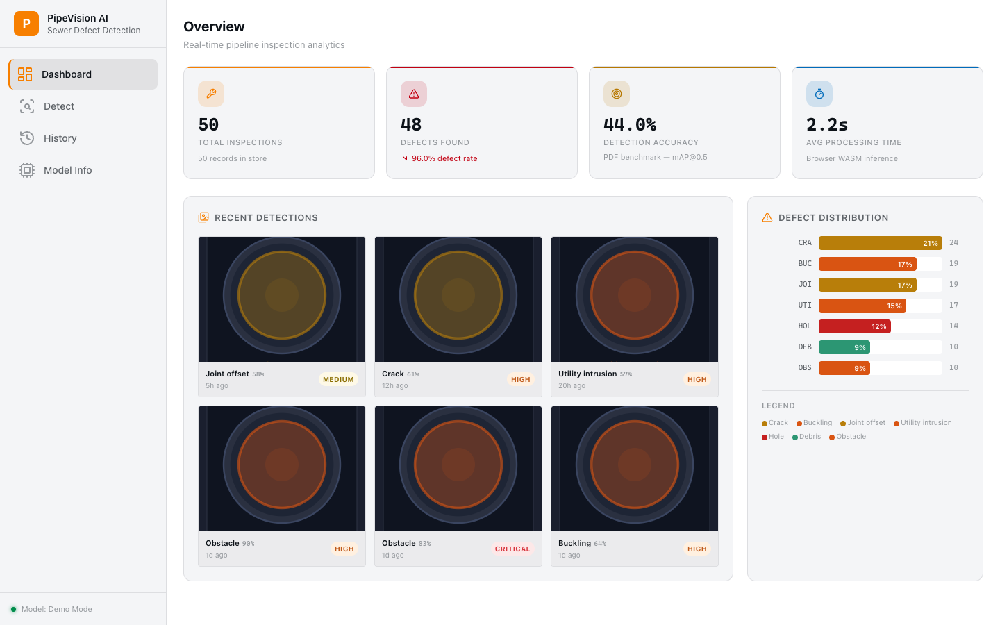
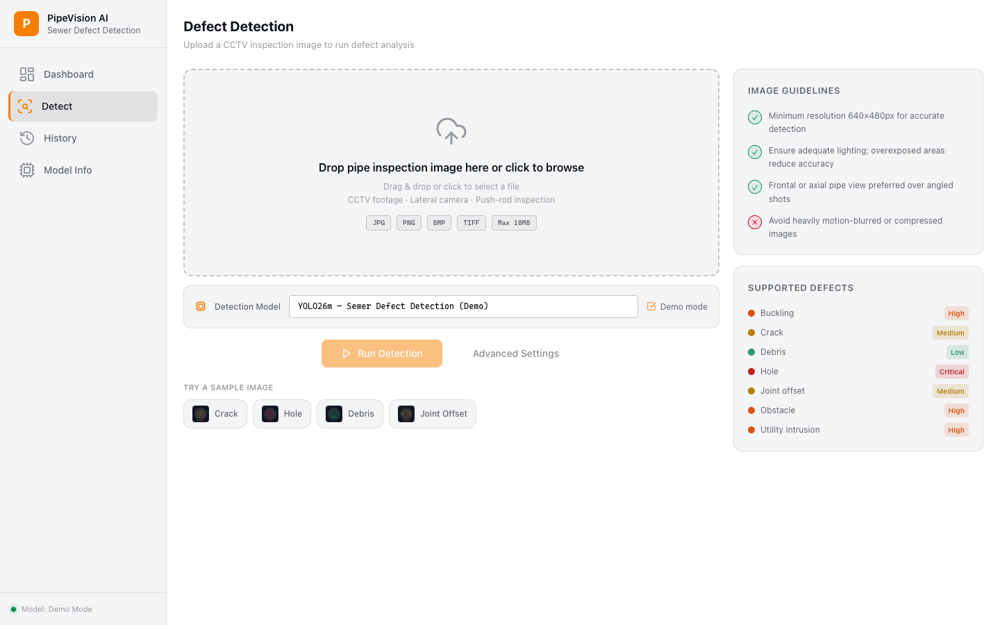
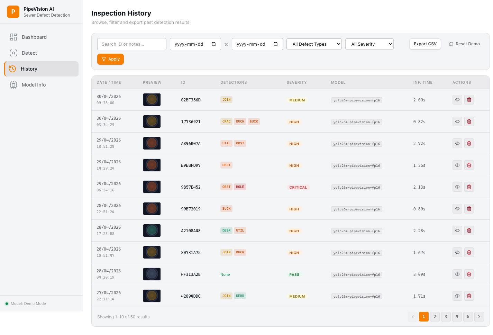
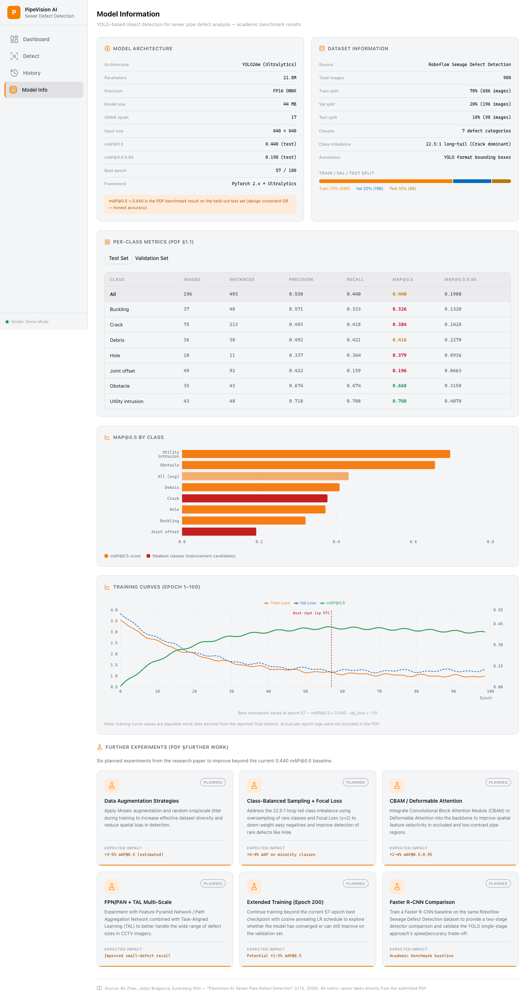

# PipeVision AI

Sewer pipe defect detection web app, built around a YOLO26m model trained on the Roboflow Sewage Defect Detection dataset.

**Project #37 · Plumbers of UTS · 42028 Deep Learning and CNN**

[](https://plumbers-of-uts.github.io/pipevision-ai/)
[](#license)

Live at https://plumbers-of-uts.github.io/pipevision-ai/

---

## Screenshots

| Dashboard | Detect |
|---|---|
|  |  |

| History | Model Info |
|---|---|
|  |  |

---

## Status

The web app is live with all four pages built and a 50-record IndexedDB demo seed. The Detect page currently uses a stub that fakes inference (1.5 s timeout + random bounding boxes) so the rest of the UI can be exercised end to end.

The actual inference path — exporting the trained `best.pt` to ONNX FP16, hosting it on Hugging Face Hub, and running it in the browser via `onnxruntime-web` — is scripted in the `model/` workspace but has not been executed yet. Hugging Face credentials and the SageMaker S3 URI are needed to run it.

## Test Set Performance

Numbers below are from the original training run reported in the team's initial experiment write-up. They are the values the demo claims to reproduce once the export pipeline is run.

| Metric | Value |
|---|---|
| mAP@0.5 | 0.440 |
| mAP@0.5:0.95 | 0.198 |
| Best epoch | 57 / 100 |
| Model size after FP16 export | ~44 MB |

Per-class mAP@0.5 ranges from 0.708 (Utility intrusion) to 0.196 (Joint offset). The Model Info page lists the full per-class table and six planned follow-up experiments.

### Defect Classes

Crack · Joint offset · Utility intrusion · Debris · Obstacle · Buckling · Hole

---

## Tech Stack

| Layer | Choice |
|---|---|
| UI | Vite 6 + React 19 + TypeScript |
| Runtime / package manager | bun 1.1+ |
| Styling | Tailwind v4 + shadcn/ui |
| Local storage | Dexie (IndexedDB), seeded on first launch |
| Charts | recharts |
| Inference (planned) | onnxruntime-web with WebGPU and WASM SIMD fallback |
| Model hosting (planned) | Hugging Face Hub |
| Code hosting | GitHub Pages, deployed via GitHub Actions |
| Lint, format, hooks | biome + lefthook + commitlint |
| Task runner | mise |

---

## Quick Start

Requires [mise](https://mise.jdx.dev/). bun is installed on first `mise install`.

```bash
git clone git@github.com:plumbers-of-uts/pipevision-ai.git
cd pipevision-ai
mise trust
bun install
mise run dev
```

The dev server is at http://localhost:5173/pipevision-ai/. On first load, IndexedDB is populated with 50 demo records so the Dashboard, History, and Models pages have content immediately.

Other tasks:

```bash
mise run build       # type-check + production build
mise run lint        # biome check
mise run format      # biome format --write
mise run typecheck   # tsc --noEmit
```

### Detect page demo flow

1. Open `/detect`.
2. Click a sample image, or drop your own.
3. Click **Run Detection**.
4. After ~1.5 s the canvas shows boxes drawn from the stub generator.
5. The result is saved to IndexedDB and appears on the Dashboard and History pages.

---

## Project Structure

```
pipevision-ai/
├── docs/
│   ├── plans/                      # design and execution plans
│   ├── exec-plans/
│   └── screenshots/
├── model/                          # ONNX export pipeline (Python, uv-managed)
│   ├── download.sh                 # SageMaker S3 → local
│   ├── export.py                   # PyTorch → ONNX FP16
│   ├── verify.py                   # PT vs ONNX mAP regression check
│   ├── upload.sh                   # → Hugging Face Hub
│   ├── metadata.yaml
│   ├── pyproject.toml
│   └── usage.md                    # step-by-step runbook
├── src/
│   ├── app/                        # router + providers
│   ├── pages/                      # dashboard, detect, history, models
│   ├── widgets/                    # page-level composition components
│   ├── features/
│   │   ├── history-store/          # Dexie schema, repository, seed
│   │   ├── samples/
│   │   └── export/
│   ├── components/ui/              # shadcn primitives
│   ├── lib/
│   └── styles/globals.css
├── .github/workflows/deploy.yml
├── DESIGN.md                       # design tokens
├── gui-mockup.html                 # original static mockup
├── mise.toml
└── README.md
```

---

## Publishing the trained model

The scripts in `model/` take the trained `best.pt` from SageMaker, export it to ONNX FP16, check that mAP has not regressed, and push the result to a Hugging Face Hub model repo. Run this once after training; re-run after any retraining.

Required environment variables:

| Variable | Description |
|---|---|
| `SAGEMAKER_MODEL_S3_URI` | Full S3 URI of the SageMaker `model.tar.gz` |
| `AWS_PROFILE` | AWS CLI profile (defaults to `default`) |
| `HF_USER` | Hugging Face username |
| `HF_TOKEN` | HF token with write access (or run `huggingface-cli login`) |
| `VAL_DATASET_YAML` | Absolute path to the Roboflow `data.yaml` |

Then:

```bash
uv sync --project model
mise run model:download   # S3 → model/artifacts/best.pt
mise run model:export     # → model/artifacts/yolo26m-fp16.onnx
mise run model:verify     # PASS if |Δ mAP@0.5| < 0.005
mise run model:upload     # → huggingface.co/<HF_USER>/pipevision-yolo26m
```

After upload, point the frontend at the model URL via `VITE_MODEL_URL` (or update `src/shared/config/env.ts`). Full instructions in [`model/usage.md`](model/usage.md).

---

## What's left

Short-term, blocked on credentials:

- [ ] Create a Hugging Face account and write token.
- [ ] Locate the SageMaker `best.pt` S3 URI (AWS Console → SageMaker → Training Jobs → Output).
- [ ] Run the four `model:*` tasks to publish the ONNX model.

Once the model is published, the next code changes are:

- [ ] Replace the Detect page stub with a real `onnxruntime-web` call (preprocess, inference, NMS in TypeScript, model loading state machine, Service Worker cache).
- [ ] Push a Gradio server-side fallback to Hugging Face Spaces.
- [ ] Lighthouse pass for performance and accessibility, code-split `onnxruntime-web` via dynamic import.

Future work (not on the critical path):

- Background model prefetch on the Dashboard route, Web Worker inference, INT8 quantization for mobile, i18n (Korean/English), opt-in anonymous telemetry, video and live-camera support.
- Six experiments listed in the original write-up to push mAP above 0.44: Mosaic and crop augmentation, class-balanced sampling with Focal Loss, CBAM or Deformable Attention, FPN/PAN with Task-Aligned Label Assignment, extended training to epoch 200, and a Faster R-CNN comparison baseline.

---

## References

1. Hidayatullah, P., & Tubagus, R. (2026). YOLO26: A comprehensive architecture overview and key improvements. *arXiv preprint* [arXiv:2602.14582](https://arxiv.org/abs/2602.14582).
2. Lin, T.-Y., Goyal, P., Girshick, R., He, K., & Dollar, P. (2018). Focal loss for dense object detection. *IEEE TPAMI*. [doi:10.1109/tpami.2018.2858826](https://doi.org/10.1109/tpami.2018.2858826).
3. Ren, S., He, K., Girshick, R., & Sun, J. (2017). Faster R-CNN: Towards real-time object detection with region proposal networks. *IEEE TPAMI*, 39(6), 1137–1149. [doi:10.1109/tpami.2016.2577031](https://doi.org/10.1109/tpami.2016.2577031).

---

## License

MIT
